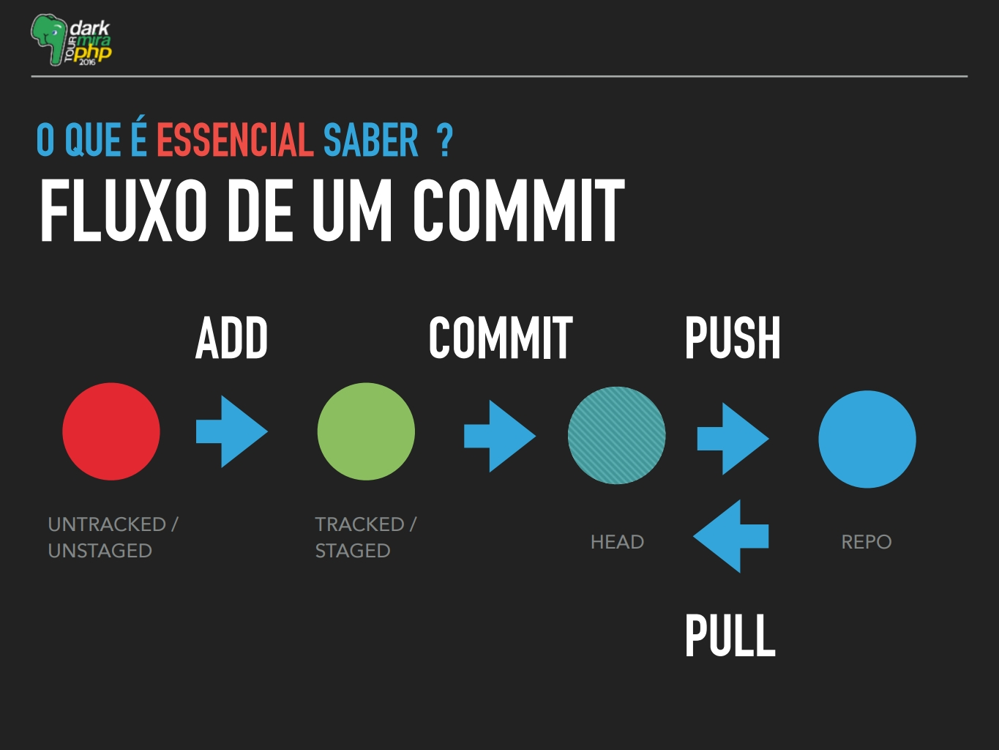

# Aula de Git

http://rogerdudler.github.io/git-guide/index.pt_BR.html

**Git** - é um software de versionamento que permite a sincronização do código com repositórios web\
**Git bash** - é um terminal onde você coloca os comandos\
**Github** - é um repositório web que compartilha o código com controle de versão usando o Git. É um portfólio para recrutadores verem a complexidade e as linguagens que trabalha, além de ser uma "rede social" de desenvolvedores. Similares: gitlab e bit bucket.

```
SUA MÁQUINA <-> NUVEM <-> OUTRA MÁQUINA
```


## Glossário

- **repositório** = projeto
- **branch** = é uma timeline (linha do tempo)
- **commit** = são pontos de alteração nos branchs
- **git flow** = é o fluxo de trabalho por branchs
- **merge** = união de dois branchs
- **clone** = cópia de uma branch de repositório online em repositório local
- **fork** = o fork é como um clone, mas dentro do github. Ele não baixa no computador, mas cria uma cópia na sua conta.
- **pull** = incorpora as mudanças de um repositório remoto para o branch local.
- **fetch** = atualiza as referências locais com relação às remotas, mas não faz merge com o branch local. Para incorporar, precisa executar um merge `git merge FETCH_HEAD` com o local.
- **pull request** = é um pedido que se faz ao dono do repositório para que este atualize o código dele com o seu código. Ou seja, você pede ao dono do projeto para adicionar as modificações ao repositório oficial.
- **untracked/unstage** = estado inicial de arquivos que precisam ser adicionados ao Stage (área de preparação)
- **tracked/staged** = os arquivos selecionados em `git add` são preparados para serem enviados
- **head** = É uma referência para um objeto commit.



## Comandos básicos de terminal e git

```
git status                        //Mostra a situação do git neste repositório - EXECUTAR SEMPRE
git remote                        //Mostra a etiqueta do arquivo de origem
git remote -v                     //Mostra a url do repositório de origem

pwd                               //Mostra caminho da pasta atual
cd ..                             //Vai para pasta acima
cd nome_da_pasta                  //entra na pasta citada
ls                                //lista os arquivos da pasta
ls -la                            //lista com detalhes de data, criação de arquivo...
mkdir nome_da_pasta               //cria uma pasta
touch nome_do_arquivo             //cria arquivo
rm nome_arquivo.txt               //remove arquivo definitivamente(sem perguntar)
rm -rf nome_da_pasta              //remove arquivo definitivamente(sem perguntar)
mv nome_do_arquivo novo_caminho   //move o arquivo para o novo_caminho
clear                             //esconde o histórico do console

git checkout -b branch            //sai da branch atual e cria uma nova com o nome "branch"git ch
git checkout branch               //sair da branch atual e vai para a branch com o nome "branch"
git log                           //Traz os commits daquela branch
```

### Alguns comandos intermediários

#### Git add -p

Passa por todas as alterações e você poderá dizer qual deve ser adicionada e qual não deve. O `-p` é de patch.

Usado quando você fez alterações em contextos diferentes e precisa de mais de um commit, ou commit separados de alterações de um mesmo arquivo.
```
git add -p
```

#### Git stash

É uma pilha de modificações inacabadas que pode ser retornada mais tarde. Só deve ser utilizado em arquivos que não foram staged (preparados/ add) nem consolidados (commitados).

```
//salva modificações em um stash
git stash

//recupera o stash na branch atual
git stash pop

//lista os arquivos do stash
git stash list
```

[Mover mudanças feitas em um branch para outro (que não foram adicionadas nem commitadas)](https://education.launchcode.org/web-fundamentals/tutorials/git-stash/)

[Documentação do Stash](https://git-scm.com/book/pt-br/v1/Ferramentas-do-Git-Fazendo-Stash)

#### Merge/ Rebase

https://www.concrete.com.br/2017/09/04/git-para-corajosos-rebase-parte-1/

## Como iniciar um repositório do computador
1. Criar uma pasta para o repositório e clicar com o botão direito e Git Bash Here

2. Inicializar o git nesta pasta (só é realizado em pastas que não têm o git inicializado)
```
git init
```
3. Criar um repositório no Github

4. Indicar o repositório web no git local
```
git remote add origin endereco_do_repositorio
```
O local pode ser a url do navegador, ou do botão Clone/ Download (selecionar SSH se estiver em um PC configurado com as suas chaves)

5. Adicionar os arquivos locais no repositório local
```
git add .
```

6. Etiquetar os arquivos com um comentário sobre os arquivos
```
git commit -m "Digite a mensagem"
```

7. Atualizar arquivos do repositório web para o local (Download)
```
git pull
```
Isso evita conflitos de versionamento, principalmente em casos de mais de uma pessoa comitando o mesmo repositório

8. Atualizar arquivos do repositório local para o web (Upload)

```
git push -u origin master
//não só faz o push como também seta que o seu branch padrão é o master, permitindo usar só git push/ git pull sem ficar definindo origin master no futuro.
```

## Como clonar um repositório

```
git clone endereco_do_repositorio
cd nome_da_pasta_criada
add .
commit -m "nome do commit"
git pull
git push
```

## Problemas vivenciados com o git

### Mudar a url do remote (geralmente entre https e ssl)

Conferir qual a url do repositório
```
git remote -v
```

Modificar a url
```
git remote set-url nova_url
```

### Quanto tem erro "refusing to merge unrelated histories"

```
git pull --allow-unrelated-histories
```

### Erro "The current branch master has no upstream branch" ao dar git pull/git push

Isso acontece quando não há branch setado para ser usado sem argumentos, cru no git pull ou git push. Por isso, é importante ter o -u setado quando fizer o primeiro pull/ push.

```
//git push nome_da_origem nome_do_branch
git push -u origin master
```

### Proteger a master de commits

https://help.github.com/en/articles/configuring-protected-branches

### Limpar a master (depois de merge com development ou backup)

https://blog.tomasfejfar.cz/git-how-to-make-master-empty/

### Em caso de emergência em uma tela azul
Ctrl+C :quit

### Caso o commit tenha sido feito no branch errado

1. Insira o comando `git log` e guarde o SHA do commit que você quer mover

2. Faça `git checkout` para o branch de destino do commit que você quer mover

3. Digite `git cherry-pick SHA`, substituindo o SHA pelo guardado acima. (Vai abrir uma tela com as modificações do commit para escolher para mover, selecione tudo)

4. Volte para o branch de origem

5. Use `git reset HEAD~1` para resetar para antes do commit errado

Cherry-picking é um comando do git que permite ao usuário escolher os commits que deseja mandar à uma branch. Assim, ele pode analisar os commits em outra branch do repositório e escolher aquelas que são úteis para ir para sua branch.

É um comando útil, pois permite a adição de apenas commits importantes, evitando commits que estão sem testes ou que contém erros. Além disso, esse comando auxilia no desenvolvimento de softwares colaborativos, visto que vários usuários mandam alterações no código a todo momento. Usando o cherry-picking, é possível escolher os commits relevantes e de qualidades dos colaboradores, para depois levá-los às branchs principais, como a master.

## O .gitignore
É um arquivo que você cria que lista todos os arquivos e pastas que devem ser ignorados no push.
Os commits após a criação deste arquivo serão ignorados.
Ainda não sei exatamente como, mas ele é bastante utilizado para ignorar arquivos com dados sensíveis, como senhas.

## Criar chave SSH em Linux

https://medium.com/@rgdev/como-adicionar-uma-chave-ssh-na-sua-conta-do-github-linux-e0f19bbc4265

```
ssh -T git@github.com
# Attempts to ssh to GitHub
```

## Chegou no projeto, como criar um branch só seu

1. Acabou de chegar no projeto, vai na pasta onde você vai colocar carinhosamente o nosso projeto, clica no botão direito e dá um **Git Bash Here**. Essa pasta onde você clica com o botão direito não pode ter uma pasta .git.

2. Clona o nosso projeto com o comando `git clone https://github.com/eduaupin/apicomidadh.git`. Foi criada uma pasta para o nosso projeto, entre nela com o comando `cd apicomidadh`.

3. Cria um canto todo seu com o comando `git checkout -b seunome`. Isso vai mudar automaticamente para o seu branch, e caso futuramente você volte para ele, use o comando `git checkout seunome`.

4. Antes de codar, é bom verificar se os arquivos estão atualizados com o development. Faça sempre `git pull origin development`. Caso queira atualizar os seus arquivos de acordo com o nome de um colega, use `git pull origin nomedabranchdocolega`.

Quando estiver pronto para enviar os seus arquivos, **confira se você está no seu branch (pelo nome azul na frente do caminho no Bash)**, e então você vai precisar fazer os passos `git add .` e `git commit -m "Sua mensagem"`

5. Quando terminar (ou quiser salvar o progresso), faça `git push origin seunome`.

Note que tanto no item 4 como aqui, não indico o uso do `-u`, porque não queremos colocar um branch como padrão e acabar upando no branch errado.

6. Ao final do sprint, peça o pull request para a branch development pelo github.
